<p align="center">
  
</p>

# Wormhole

Wormhole is a local-first MCP coding agent written in Go. It runs beside your repositories, gives ChatGPT controlled access to local files and development tools, and can connect private workspaces through OpenAI Secure MCP Tunnel without exposing a public server.

## What it provides

- One local daemon for multiple repositories.
- Per-chat workspace selection with `workspace <id>`.
- A compact `fast` tool profile for everyday coding and a complete `main` profile for advanced workflows.
- Root-confined file, Git, command, patch, review, process, memory, and upstream MCP tools.
- `strict`, `balanced`, and `full` policies with exact, expiring approvals for risky actions.
- Bounded logs, backups, audit records, process output, caches, and workspace state.
- A single native binary for Linux, macOS, and Windows.

For package ownership, runtime internals, and security invariants, see [docs/ARCHITECTURE.md](docs/ARCHITECTURE.md).

## Requirements

For local use:

- Git.
- Go 1.25 or later only when building from source.
- `rg` and `codegraph` are optional.

For ChatGPT through Secure MCP Tunnel:

- A ChatGPT workspace with custom MCP app access and Developer mode enabled. OpenAI currently documents full MCP apps for ChatGPT Business, Enterprise, and Edu on the web.
- An OpenAI Platform organization permitted to use Secure MCP Tunnel.
- A tunnel scoped to the target ChatGPT workspace.
- A restricted Runtime API key with **Tunnels Read + Use**.

ChatGPT now calls this integration a **custom app** or **MCP app**. Older interfaces may call it a custom connector. It is not a legacy ChatGPT plugin.

Official references:

- [Developer mode and MCP apps in ChatGPT](https://help.openai.com/en/articles/12584461-developer-mode-and-mcp-apps-in-chatgpt)
- [OpenAI tunnel-client end-user guide](https://github.com/openai/tunnel-client/blob/master/docs/end-user-guide.md)
- [OpenAI tunnel-client releases](https://github.com/openai/tunnel-client/releases/latest)

## Install

### Linux and macOS

```bash
curl -fsSL https://raw.githubusercontent.com/qunv/wormhole/main/install.sh | sh
wormhole --version
```

The installer downloads the matching release, verifies its checksum, and installs to `~/.local/bin` by default.

### Windows

Download the matching archive and `checksums.txt` from the [latest Wormhole release](https://github.com/qunv/wormhole/releases/latest), verify the SHA-256 checksum, extract `wormhole.exe`, and add its directory to your user `PATH`.

### Build from source

```bash
git clone https://github.com/qunv/wormhole.git
cd wormhole
go test ./...
make install
```

## Connect Wormhole to ChatGPT

The complete flow is:

```text
ChatGPT MCP app
  → OpenAI Secure MCP Tunnel
  → tunnel-client running on your machine
  → Wormhole at http://127.0.0.1:8132
  → selected local workspace
```

### 1. Configure Platform permissions

In OpenAI Platform, create or assign roles before creating keys:

| Operator | Required tunnel permissions |
|---|---|
| Runs Wormhole/tunnel-client | Tunnels Read + Use |
| Creates or edits tunnels | Tunnels Read + Manage |
| Does both | Tunnels Read + Manage + Use |

Print the Tunnels and Runtime API-key URLs with:

```bash
wormhole keys
```

Role and group configuration is available on these pages:

- [Organization roles](https://platform.openai.com/settings/organization/people/roles)
- [Organization groups](https://platform.openai.com/settings/organization/people/groups)
- [Tunnels](https://platform.openai.com/settings/organization/tunnels)
- [Runtime API keys](https://platform.openai.com/settings/organization/api-keys)

Prefer assigning roles through groups when multiple operators need access.

### 2. Create the Secure MCP Tunnels

Open [Platform → Organization → Tunnels](https://platform.openai.com/settings/organization/tunnels). For the recommended setup, create two tunnels:

| Tunnel | Local mode | Purpose |
|---|---|---|
| `wormhole-fast` | `fast` | Default coding app with the compact tool contract |
| `wormhole-full` | `full` | Optional app for memory, processes, approvals, diagnostics, and upstream MCP tools |

For each tunnel:

1. Scope it to the correct Platform organization.
2. Include the target ChatGPT workspace ID. A tunnel without the correct workspace scope may exist in Platform but not appear in ChatGPT's tunnel picker.
3. Copy the returned ID, which looks like `tunnel_0123456789abcdef0123456789abcdef`.

Wormhole also retains the legacy one-tunnel configuration for existing installations, but two named tunnels are recommended because the current ChatGPT tunnel picker selects a Tunnel ID and does not expose the tunnel-client's logical channel field.

### 3. Create the Runtime API key

Open [Platform → Organization → API keys](https://platform.openai.com/settings/organization/api-keys) and create a **Restricted** Runtime API key with:

```text
Tunnels Read
Tunnels Use
```

Do not use an Admin API key for the long-running tunnel process. `OPENAI_ADMIN_KEY` is only needed when using `tunnel-client admin tunnels create|update|delete`.

Keep these values separate:

| Value | Used for |
|---|---|
| Tunnel ID | Identifies the tunnel shared by ChatGPT and tunnel-client |
| Runtime API key | Authenticates the long-running tunnel-client process |
| Admin API key | Optional tunnel-management CLI operations only |

### 4. Configure and start Wormhole

Install OpenAI's tunnel client:

```bash
wormhole tunnel install
```

Open the Admin UI and add the named tunnel definitions under **Configuration → Tunnel definitions**:

```json
{
  "noTunnel": false,
  "tunnels": {
    "fast": {
      "enabled": true,
      "tunnelId": "tunnel_FAST_ID",
      "mode": "fast",
      "profile": "wormhole-fast",
      "runtimeKeyEnv": "CONTROL_PLANE_API_KEY_FAST"
    },
    "full": {
      "enabled": true,
      "tunnelId": "tunnel_FULL_ID",
      "mode": "full",
      "profile": "wormhole-full",
      "runtimeKeyEnv": "CONTROL_PLANE_API_KEY_FULL"
    }
  }
}
```

Store each Runtime API key separately from `config.json`:

```bash
wormhole key set --runtime-key-env CONTROL_PLANE_API_KEY_FAST
wormhole key set --runtime-key-env CONTROL_PLANE_API_KEY_FULL
```

The values are written to the owner-only `~/.wormhole/.env` file. The Admin **Secrets** page provides the same write-only workflow.

Generate both profiles, start Wormhole, and verify every managed process:

```bash
wormhole profile
wormhole restart
wormhole doctor
wormhole status
wormhole tunnel list
```

Wormhole runs one local MCP daemon and one tunnel-client process per enabled tunnel. The generated Fast profile maps its `main` channel to `/mcp/session/fast`; the Full profile maps `main` to `/mcp/session`.

Existing single-tunnel configurations using `tunnelId`, `profile`, and `runtimeKeyEnv` continue to work and keep the historical logical channels for backward compatibility.

### 5. Create the MCP app in ChatGPT

First enable Developer mode for the ChatGPT workspace. OpenAI documents the admin control under:

```text
Workspace Settings
  → Permissions & Roles
  → Connected Data
  → Developer mode / Create custom MCP connectors
```

Create two apps:

1. Open **Settings → Apps → Create**, or **Workspace Settings → Apps → Create** as an admin/owner.
2. Create `Wormhole Fast`, select **Tunnel** or **Secure MCP Tunnel**, and choose `tunnel_FAST_ID`.
3. Choose **No auth** for the MCP app. Tunnel control-plane authentication is handled by the Runtime API key stored on the machine.
4. Click **Scan Tools**, verify the compact tool set, and create the app.
5. Repeat for `Wormhole Full` with `tunnel_FULL_ID` and verify the expanded tool set.

The ChatGPT UI does not need a channel selector: each Tunnel ID has its own generated profile whose `main` channel points to the intended local endpoint.

The app should appear under enabled apps with a `Dev` label until it is published by a workspace admin.

OpenAI may change labels while MCP apps remain in beta. The current official flow is documented in the [Developer mode guide](https://help.openai.com/en/articles/12584461-developer-mode-and-mcp-apps-in-chatgpt).

### 6. Use it in a chat

Open a new ChatGPT conversation and enable the Wormhole app from the tools menu. Then select a repository:

```text
workspace wormhole
```

Use a different workspace in another chat:

```text
workspace loyalty-api
```

ChatGPT receives an opaque workspace binding automatically. You do not need to copy or manage that token. Bindings expire after inactivity and are reset when Wormhole restarts; say `workspace <id>` again when needed.

## Which managed tunnel mode should I use?

| Mode | Local endpoint published as `main` | Use case |
|---|---|---|
| `fast` | `/mcp/session/fast` | Recommended default. Compact coding profile with high-value read, edit, command, Git, CodeGraph, and quality tools |
| `full` | `/mcp/session` | Memory, workflow, managed processes, approvals, diagnostics, security, and upstream MCP tools |

Enable only the Fast app for normal coding. Enable the Full app when the task genuinely requires its larger tool surface. Both use the same workspace-selection workflow and the same local daemon.

After changing tunnel definitions, IDs, modes, profiles, runtime keys, or enabled state, run `wormhole restart` and rescan the corresponding app's tools in ChatGPT.

## Workspaces

Running `wormhole` inside a Git repository starts the daemon and automatically registers that repository when necessary:

```bash
cd /path/to/repository
wormhole
```

Manage workspaces explicitly:

```bash
wormhole workspace add loyalty-api /path/to/loyalty-api
wormhole workspace add admin-web /path/to/admin-web \
  --extra-root /path/to/shared-contracts

wormhole workspace list
wormhole workspace status loyalty-api
wormhole workspace stop loyalty-api
wormhole workspace start loyalty-api
wormhole workspace compact loyalty-api --dry-run
wormhole workspace compact loyalty-api
wormhole workspace remove admin-web
```

Each workspace has isolated roots, policy, state, backups, approvals, tasks, memory scope, and process registry. All enabled workspaces share one daemon and one port; every enabled named tunnel has its own managed tunnel-client process.

## Local use without ChatGPT

Run only the local MCP server:

```bash
wormhole start \
  --workspace /path/to/repository \
  --no-tunnel \
  --background \
  --save
```

For foreground debugging:

```bash
wormhole serve --workspace /path/to/repository --no-tunnel
```

Local endpoints:

```text
http://127.0.0.1:8132/mcp/session/fast
http://127.0.0.1:8132/mcp/session
http://127.0.0.1:8132/mcp/session/profiles/<profile-id>
http://127.0.0.1:8132/mcp/fast
http://127.0.0.1:8132/mcp/profiles/<profile-id>
http://127.0.0.1:8132/mcp
http://127.0.0.1:8132/healthz
http://127.0.0.1:8132/internal/healthz
http://127.0.0.1:8132/admin/
```

## Remote MCP ingress (Notion and other hosted MCP clients)

OpenAI Secure MCP Tunnel is intentionally specific to supported OpenAI clients. For a hosted MCP client that needs a normal public HTTPS URL, Wormhole can run one or more **remote MCP ingresses** alongside the OpenAI tunnels.

A remote ingress does **not** publish the main `:8132` listener. Instead, the daemon opens a dedicated loopback-only port that serves exactly one fixed workspace/profile contract at `/mcp`:

```text
Notion / hosted MCP client
        │
        │ HTTPS + Authorization: Bearer <MCP token>
        ▼
HTTPS publisher
  ├── external: Caddy / Nginx / Tailscale / Cloudflare you manage
  └── cloudflare: cloudflared child managed by Wormhole
        │
        ▼
127.0.0.1:18133/mcp       dedicated remote ingress
        │
        └── fixed workspace + fixed tool profile

127.0.0.1:8132            normal Wormhole listener
        ├── /admin/        local only; not mounted on the remote ingress
        ├── /mcp/session   workspace-routing client surface
        └── /mcp/...       local/OpenAI-tunnel surfaces
```

`provider: "external"` is the generic default: Wormhole owns only the loopback MCP listener while you publish it through an HTTPS reverse proxy or tunnel of your choice. `provider: "cloudflare"` is the first managed publisher: Wormhole starts one `cloudflared` child per enabled ingress using `TUNNEL_TOKEN` in the child environment; the provider token is never placed in command-line arguments. In both modes, the MCP bearer token is a separate secret and is checked by the dedicated listener before any MCP request reaches the selected runtime.

The built-in `remote-read` profile is the safe default for an Internet-reachable ingress. It exposes bounded workspace/context, code navigation, file reads, and Git read operations, but not patching, commands, quality-gate execution, or mutating Git actions. Create a custom profile only when a hosted client needs a different contract. For example, a Notion-specific read profile plus one fixed ingress:

```json
{
  "toolProfiles": {
    "notion-read": {
      "name": "Notion read access",
      "description": "Read-only repository context for a Notion Custom Agent.",
      "allowedTools": [
        "workspace_info",
        "workspace_snapshot",
        "task_context",
        "codegraph_explore",
        "search_text",
        "read_file",
        "read_many",
        "git_status",
        "git_diff"
      ],
      "outputMode": "structured",
      "compactDefaults": true
    }
  },
  "remoteIngresses": {
    "notion": {
      "enabled": true,
      "provider": "cloudflare",
      "workspaceId": "wormhole",
      "toolProfile": "notion-read",
      "localPort": 18133,
      "publicUrl": "https://wormhole.example.com/mcp",
      "authTokenEnv": "WORMHOLE_REMOTE_NOTION_AUTH_TOKEN",
      "providerTokenEnv": "WORMHOLE_REMOTE_NOTION_TUNNEL_TOKEN",
      "binary": "cloudflared"
    }
  }
}
```

`workspaceId` may be omitted to bind the primary runtime. `toolProfile` defaults to `remote-read`. Enabled ingress ports must be unique and must differ from the main Wormhole port. `publicUrl`, when recorded, must be an HTTPS URL whose path is exactly `/mcp`. If a client sends an HTTP `Origin` header, Wormhole validates it against the origin of `publicUrl` and rejects a mismatch with `403`; when `publicUrl` is omitted, requests that carry `Origin` fail closed while server-to-server requests without `Origin` remain valid.

For `provider: "cloudflare"`, store both referenced values from **Admin → Secrets**, or with the write-only CLI helper. For `external`, only the MCP bearer is owned by Wormhole:

```bash
wormhole key set --runtime-key-env WORMHOLE_REMOTE_NOTION_AUTH_TOKEN
# cloudflare managed mode only:
wormhole key set --runtime-key-env WORMHOLE_REMOTE_NOTION_TUNNEL_TOKEN
```

The structured Admin ingress editor also provides a safer credential-handoff path for hosted clients. After the ingress definition is saved, **Generate bearer** creates 256 bits of randomness in the browser, writes the value through the existing write-only Secrets API, and shows it only in the current browser state so it can be copied into Notion. Wormhole never adds a secret-read endpoint and cannot display the persisted value again. Rotating the bearer requires a daemon restart before the hosted client should switch to the new value.

With managed Cloudflare, configure the remotely managed tunnel's public hostname to forward to the exact local origin for this ingress, for example:

```text
https://wormhole.example.com  →  http://127.0.0.1:18133
```

Then configure the hosted MCP client with:

```text
MCP URL:        https://wormhole.example.com/mcp
Authorization:  Bearer <value of WORMHOLE_REMOTE_NOTION_AUTH_TOKEN>
```

The Admin **Hosted client connection kit** renders these values from the selected ingress, provides copy actions for the URL/header and a one-time exact bearer value after generation, shows the active workspace/profile/protocol/tool count, and warns when a save/restart or profile rescan is still required. Public Internet reachability remains a separate publisher concern and is not silently probed by the local Admin server.

Restart Wormhole after changing ingress definitions or referenced secrets. `wormhole status` reports listener/provider ownership and secret presence without exposing values. `wormhole doctor` goes further: after checking the loopback socket and bearer reference, it performs a real MCP connection and `tools/list`, reporting the negotiated protocol and tool count. This catches cases where a port is open but authentication or the MCP contract is broken. The Admin diagnostic bundle includes ingress metadata and bounded ingress logs while redacting the currently referenced secret values.

When the local listener is healthy and the HTTPS publisher is configured, explicitly verify the route a hosted client will use:

```bash
wormhole remote list
wormhole remote verify notion
wormhole remote verify notion --json
```

`remote verify` is intentionally an operator-invoked network action rather than a background/Admin probe. It authenticates against both the dedicated loopback listener and the configured `publicUrl`, discovers the bounded tool catalog, and compares the negotiated protocol plus a deterministic hash of the complete discovered tool metadata. Redirects are not followed, so the MCP bearer cannot be forwarded to a different redirect target. A successful `MATCH` proves that the public endpoint currently presents the same MCP contract as the local ingress; it does not test the hosted client's workspace permissions or product-side policy.

Wormhole pins the stable official Go SDK with MCP `2026-07-28` support. The dedicated ingress is stateless, which is required for that protocol generation, and remains compatible with older Streamable HTTP clients through the SDK's negotiation path. Authenticated `GET /mcp` is allowed to reach the transport; a stateless server may correctly answer `405 Method Not Allowed` when the client requests the optional standalone SSE stream.

Official setup references:

- [Notion MCP connections for Custom Agents](https://www.notion.com/help/mcp-connections-for-custom-agents)
- [Cloudflare Tunnel run parameters](https://developers.cloudflare.com/cloudflare-one/connections/connect-networks/configure-tunnels/tunnel-run-parameters/)

## Admin UI

Wormhole includes a local administration console for the complete non-secret configuration, named-workspace registration and removal, directory browsing, workspace overrides, upstream MCP servers, structured remote MCP ingress management, memory, tool exposure, resource limits, referenced secrets, live operations, exact approvals, and bounded audit exploration.

Open `http://127.0.0.1:8132/admin/`. When no local admin credential exists, the loopback-only first-run screen asks for a username and password, creates the account once, signs in, and opens the guided setup wizard. The wizard covers workspace, mode, policy, port, OpenAI tunnel ID, write-only Runtime API key, and optional memory settings.

The CLI remains available for account creation and administration:

```bash
wormhole admin set-password admin
wormhole restart
wormhole admin
```

The username and a salted one-way password hash are stored in the owner-only file `~/.wormhole/admin-auth.json`; the plaintext password is never persisted. The browser bootstrap endpoint uses exclusive create semantics and stops accepting setup after that file exists. The default URL is `http://127.0.0.1:8132/admin/`. The UI is embedded in the Wormhole binary and does not require a separate web server in production.

There is no browser password-recovery flow. If the password is forgotten, reset it from the local machine:

```bash
wormhole admin reset-password admin
```

Changing the username or password immediately invalidates existing Admin UI browser sessions. Check the configured account without revealing credential material with `wormhole admin status`.

Security boundaries are enforced by the Go server:

- Admin routes accept only loopback clients and `localhost` or loopback-IP Host headers.
- Every Admin API route except login status, login, and the create-only first-account endpoint requires an authenticated, bounded HttpOnly session cookie.
- Failed logins are throttled. The first account may be created once from the loopback UI; password changes, reset, and recovery remain local-CLI-only.
- Every write, including login and logout, requires an exact same-origin request and a CSRF token.
- Configuration and workspace-registry saves use revision checks to prevent overwriting concurrent changes.
- The workspace browser is directory-only, bounded, and confined to the current user's home directory; an existing absolute path may still be entered manually.
- Runtime tokens are excluded from JSON configuration.
- Referenced `.env` secrets are write-only; the UI can see only whether each value exists.
- Changes are persisted atomically. The Configuration page can schedule a detached lifecycle-helper restart after the HTTP response is delivered; the browser waits for the replacement daemon and then returns to sign-in because Admin sessions are process-local.

The Admin UI can run the guided setup flow, open OpenAI tunnel and API-key settings in new tabs, persist a tunnel ID, store referenced secrets write-only, browse directories, register named workspaces, remove registrations, optionally delete a workspace override file, visualize inherited versus overridden workspace fields, preview safe override compaction, create and edit custom tool profiles, map named tunnels to profiles, create/edit/remove remote MCP ingresses with provider-specific fields and workspace/profile selectors, inspect each running ingress's bounded local MCP readiness (bearer presence, loopback reachability, negotiated protocol, and tool count), inspect live runtime/module metrics, approve or deny exact pending actions through the authenticated local control plane, refresh upstream MCP catalogs while previewing active/cached/live contract diffs, explore a bounded tail of already-redacted audit records, and download a sanitized diagnostic JSON bundle. Remote-ingress readiness probes never call the configured public URL and never return secret values; external publisher health remains the operator/provider's responsibility. Browser same-origin rules prevent Wormhole from reading or auto-filling OpenAI Platform pages, so generated IDs and keys must be pasted into the local inputs. Removal preserves repository files and workspace runtime state. Daemon restart, tunnel-client installation, and process lifecycle remain explicit/revision-safe operations; config changes require a restart before active MCP endpoints are reconciled.

### Admin UI development

The production assets are committed under `internal/adminui/dist` so normal Go builds remain single-step. Node.js is needed only when modifying the frontend:

```bash
make admin-ui-check
make admin-ui
```

For a development server with API proxying:

```bash
cd web/admin
npm install
npm run dev
```

## Common commands

| Command | Purpose |
|---|---|
| `wormhole` | Start and auto-register the current Git repository |
| `wormhole setup` | Configure workspace, policy, tunnel, and optional memory |
| `wormhole restart` | Reconcile config and restart server/tunnel |
| `wormhole status --json` | Show endpoints, process IDs, and health |
| `wormhole doctor` | Check local server, tunnel, memory, upstream MCP, and local remote-ingress readiness |
| `wormhole remote list` | Show configured hosted-MCP ingresses and secret-presence state without values |
| `wormhole remote verify <name>` | Explicitly verify the local and public MCP routes expose the same authenticated contract |
| `wormhole logs` | Print bounded server and tunnel log tails |
| `wormhole profile` | Regenerate the tunnel-client profile |
| `wormhole tunnel install` | Download and verify OpenAI tunnel-client |
| `wormhole admin` | Print the local Admin UI URL |
| `wormhole admin set-password [username]` | Create or replace the local Admin account |
| `wormhole admin reset-password [username]` | Reset the password and invalidate browser sessions |
| `wormhole admin status` | Show whether the local Admin account is configured |
| `wormhole key set` | Store the Runtime API key in `.env` |
| `wormhole config get` | Print the effective non-secret configuration |
| `wormhole state gc --dry-run` | Preview safe state cleanup |
| `wormhole help` | Show the complete CLI surface |

## Configuration and secrets

Persistent data lives under:

```text
~/.wormhole/
  admin-auth.json
  config.json          non-secret global configuration
  .env                 Runtime API key and referenced secrets
  workspaces.json      named-workspace registry
  workspaces/<id>/     named-workspace configuration overrides
  state/               logs, process state, audit, backups, approvals, caches
```

Set `WORMHOLE_HOME=/custom/path` to relocate the complete tree.

Configuration precedence:

```text
primary runtime: defaults → config.json → environment → CLI options
named runtime:   primary effective config → workspaces/<id>/config.json override → registry/listener ownership
```

Named workspace files are versioned partial overrides rather than full snapshots. A newly registered workspace normally stores only `schemaVersion`, `extraRoots`, and explicitly supplied workspace options, so later global memory, MCP, limits, and policy changes are inherited automatically. Objects merge recursively, arrays replace the inherited array, `false` remains an explicit override, and `null` removes an inherited key. Unknown fields and duplicate JSON keys are rejected instead of being silently ignored.

For example, this workspace uses another database URI while inheriting the global command, startup mode, timeouts, and tool policy:

```json
{
  "schemaVersion": 1,
  "mcpServers": {
    "postgres_prod": {
      "envRefs": {
        "DATABASE_URI": "POSTGRES_API_MCP_DATABASE_URI"
      }
    }
  }
}
```

To disable one inherited server for a workspace, use `"enabled": false`; to remove it from the effective map entirely, set that server entry to `null`. Existing full workspace config files remain valid, but every field present in them is treated as an explicit override. Use `wormhole workspace compact <id> --dry-run` to preview removal of values that merely duplicate the current global config, then rerun without `--dry-run` to persist the compact version. An explicit `extraRoots: []` is preserved so future global roots do not leak into that workspace.

Custom tool profiles filter the globally enabled runtime catalog; they cannot re-enable a globally denied tool. Empty allow lists expose every globally enabled tool before the profile deny list is applied. Allow groups and exact allow tools form a union, while denied tools always win:

```json
{
  "toolProfiles": {
    "review": {
      "name": "Code Review",
      "description": "Read repository state and inspect diffs without arbitrary execution.",
      "allowedGroups": ["filesystem", "repo"],
      "allowedTools": ["quality_gate"],
      "deniedTools": ["git"],
      "outputMode": "structured",
      "compactDefaults": true
    }
  },
  "tunnels": {
    "review": {
      "tunnelId": "tunnel_0123456789abcdef0123456789abcdef",
      "mode": "full",
      "toolProfile": "review",
      "profile": "wormhole-review",
      "runtimeKeyEnv": "CONTROL_PLANE_API_KEY"
    }
  }
}
```

A custom profile is available after restart at `/mcp/session/profiles/<id>`, `/mcp/profiles/<id>`, and `/mcp/workspaces/<workspace-id>/profiles/<id>`. The built-in `/fast` and full endpoints remain unchanged. The Profiles page previews the persisted contract immediately and marks it as requiring restart when it differs from the active runtime.

Minimal tunnel-related configuration:

```json
{
  "workspace": "/path/to/repository",
  "mode": "safe",
  "policy": "balanced",
  "host": "127.0.0.1",
  "port": 8132,
  "noTunnel": false,
  "tunnelId": "tunnel_0123456789abcdef0123456789abcdef",
  "runtimeKeyEnv": "CONTROL_PLANE_API_KEY"
}
```

Runtime-only secrets can be provided through environment variables:

```bash
export CONTROL_PLANE_API_KEY="..."
export MCP_AUTH_TOKEN="..."
export AGENT_APPROVAL_TOKEN="..."
```

Do not commit `.env`, API keys, tunnel credentials, local state, or private workspace configuration.

## Optional upstream MCP servers

Wormhole can expose tools from trusted stdio or Streamable HTTP MCP servers under the same workspace policy and audit pipeline.

Example:

```json
{
  "mcpServers": {
    "postgres_prod": {
      "transport": "stdio",
      "command": "uvx",
      "args": ["postgres-mcp", "--access-mode=restricted"],
      "envRefs": {
        "DATABASE_URI": "POSTGRES_PROD_MCP_DATABASE_URI"
      },
      "required": false,
      "workspaceIds": ["wormhole"],
      "startupMode": "lazy",
      "policy": {
        "default": "approval",
        "readOnlyTools": ["list_schemas", "list_tables", "describe_table"]
      }
    }
  }
}
```

`workspaceIds` limits the server to named runtimes that actually use it. An empty list or `"*"` preserves the previous behavior of exposing it in every workspace.

`startupMode` controls readiness behavior:

- `eager` is the backward-compatible default and connects before the daemon becomes ready.
- `background` registers a cached tool contract immediately, then connects and refreshes it asynchronously.
- `lazy` registers a cached tool contract immediately and connects on the first tool call.

Required servers always behave as `eager`. The first `background` or `lazy` startup without a cache performs one eager discovery so Wormhole can publish typed tools; later starts use the cache. Deferred clients refresh `tools/list` after connecting, and the refreshed contract is applied on the next Wormhole restart. The Admin MCP Servers editor can also force a fresh connection and catalog discovery. It displays active, cached, and live contract hashes plus added, removed, and changed tool names; refreshing never mutates the downstream `tools/list` contract in place.

Tool catalogs are stored owner-only under `~/.wormhole/state/upstream-mcp/catalogs`. They contain only bounded tool names, descriptions, input schemas, and annotations—not credentials, calls, arguments, results, or arbitrary upstream metadata. Wormhole retains at most 64 catalogs and prunes entries older than 90 days when saving a catalog.

Keep credentials in `.env` or the process environment, not `config.json`. Restart Wormhole after changing upstream servers so their tools are rediscovered.

Community MCP servers run as local code with your user's privileges. Pin versions and review them before enabling them.

## Optional project memory

Wormhole supports provider-neutral project memory with an agentmemory adapter. Enable it through:

```bash
wormhole setup
wormhole restart
wormhole doctor
```

Memory is historical context, not the current source of truth. Wormhole still verifies current files and repository state before editing. Raw source, patches, command output, and secrets are excluded from automatic memory capture.

See [docs/ARCHITECTURE.md](docs/ARCHITECTURE.md) for provider configuration, capture modes, queueing, retry behavior, and session scoping.

## State retention

Wormhole creates workspace state lazily and removes only regenerable or expired data:

- Repository index cache: 7 days.
- Terminal approvals: 30 days.
- Patch history: at most 50 batches, 30 days, and 256 MiB per workspace.
- One backup batch: at most 128 MiB.
- Server and tunnel logs: size-based rotation.

Durable notes, checkpoints, current tasks, decisions, and unknown files are preserved.

The Overview page can download a bounded diagnostic JSON bundle containing non-secret configuration, secret presence only, runtime/module metrics, profile hashes, workspace registry summaries, recent audit metadata without arguments or session IDs, and redacted log tails. Referenced environment values and direct upstream environment/header values are never included.

```bash
wormhole state gc --dry-run
wormhole stop
wormhole state gc
wormhole restart
```

## Security model

- Files and command working directories are confined to configured roots.
- Canonicalization blocks traversal and symlink/junction escapes.
- `safe` mode blocks destructive shell patterns and Git mutations.
- `strict` permits read and analysis operations only.
- `balanced` allows normal edits and requests exact approval for risky actions.
- `full` enables the complete workflow while catastrophic system commands remain blocked.
- A non-loopback local MCP listener requires a bearer token.
- Wormhole is not an operating-system sandbox; approved commands run with the current user's privileges.
- Audit arguments and error text are redacted and bounded before being written locally.
- Each workspace runtime limits concurrent tool execution with `maxConcurrentToolCalls` (default `16`); queued calls remain cancellable.
- Routed session tools are validated again against the selected workspace's exact input schema before dispatch.
- Tool-module panics are converted into sanitized tool errors and recorded in audit/metrics without exposing panic payloads.
- Raw workspace bindings are never persisted in audit, memory, health, or state.

## Troubleshooting

### The tunnel does not appear in ChatGPT

Check all four layers:

1. The tunnel includes the correct ChatGPT workspace scope.
2. Your ChatGPT operator and Runtime API key principal have Tunnels Read + Use.
3. `wormhole status` shows the tunnel online.
4. The ChatGPT workspace has Developer mode and custom MCP apps enabled.

Then run:

```bash
wormhole doctor
wormhole logs
wormhole profile
wormhole restart
```

Reopen **Settings → Apps → Create**, select the tunnel, and scan tools again.

### `missing Runtime API key`

```bash
wormhole key set
wormhole restart
```

### The app has an old tool list

ChatGPT may retain the discovered tool contract. Restart Wormhole after configuration changes, then rescan the app's tools or recreate the draft app.

### A workspace binding expired

In the same chat, select it again:

```text
workspace <id>
```

### Inspect local health

```bash
wormhole status --json
wormhole doctor --json
wormhole logs
```

## Development

```bash
go test ./...
go vet ./...
go build ./...
```

Useful project documents:

- [Architecture](docs/ARCHITECTURE.md)
- [Contributing](CONTRIBUTING.md)
- [Changelog](CHANGELOG.md)

## License

Wormhole is licensed under the [GNU Affero General Public License v3.0 or later](LICENSE).
