<p align="center">
  
</p>

# Codebridge

Codebridge is a local-first MCP coding agent written in Go. It runs beside your repositories, gives ChatGPT controlled access to local files and development tools, and can connect private workspaces through OpenAI Secure MCP Tunnel without exposing a public server.

## What it provides

- One local daemon for multiple repositories.
- Per-chat workspace selection with `workspace <id>`.
- A compact `fast` tool profile for everyday coding and a complete `main` profile for advanced workflows.
- Root-confined file, Git, command, patch, review, process, memory, and upstream MCP tools.
- `strict`, `balanced`, and `full` policies with exact, expiring approvals for risky actions.
- Bounded logs, backups, audit records, process output, caches, and workspace state.
- A single native binary for Linux, macOS, and Windows.

For package ownership, runtime internals, and security invariants, see [docs/ARCHITECTURE.md](docs/ARCHITECTURE.md).

## Requirements

For local use:

- Git.
- Go 1.25 or later only when building from source.
- `rg` and `codegraph` are optional.

For ChatGPT through Secure MCP Tunnel:

- A ChatGPT workspace with custom MCP app access and Developer mode enabled. OpenAI currently documents full MCP apps for ChatGPT Business, Enterprise, and Edu on the web.
- An OpenAI Platform organization permitted to use Secure MCP Tunnel.
- A tunnel scoped to the target ChatGPT workspace.
- A restricted Runtime API key with **Tunnels Read + Use**.

ChatGPT now calls this integration a **custom app** or **MCP app**. Older interfaces may call it a custom connector. It is not a legacy ChatGPT plugin.

Official references:

- [Developer mode and MCP apps in ChatGPT](https://help.openai.com/en/articles/12584461-developer-mode-and-mcp-apps-in-chatgpt)
- [OpenAI tunnel-client end-user guide](https://github.com/openai/tunnel-client/blob/master/docs/end-user-guide.md)
- [OpenAI tunnel-client releases](https://github.com/openai/tunnel-client/releases/latest)

## Install

### Linux and macOS

```bash
curl -fsSL https://raw.githubusercontent.com/qunv/codebridge/main/install.sh | sh
codebridge --version
```

The installer downloads the matching release, verifies its checksum, and installs to `~/.local/bin` by default.

### Windows

Download the matching archive and `checksums.txt` from the [latest Codebridge release](https://github.com/qunv/codebridge/releases/latest), verify the SHA-256 checksum, extract `codebridge.exe`, and add its directory to your user `PATH`.

### Build from source

```bash
git clone https://github.com/qunv/codebridge.git
cd codebridge
go test ./...
make install
```

## Connect Codebridge to ChatGPT

The complete flow is:

```text
ChatGPT MCP app
  → OpenAI Secure MCP Tunnel
  → tunnel-client running on your machine
  → Codebridge at http://127.0.0.1:8789
  → selected local workspace
```

### 1. Configure Platform permissions

In OpenAI Platform, create or assign roles before creating keys:

| Operator | Required tunnel permissions |
|---|---|
| Runs Codebridge/tunnel-client | Tunnels Read + Use |
| Creates or edits tunnels | Tunnels Read + Manage |
| Does both | Tunnels Read + Manage + Use |

Print the Tunnels and Runtime API-key URLs with:

```bash
codebridge keys
```

Role and group configuration is available on these pages:

- [Organization roles](https://platform.openai.com/settings/organization/people/roles)
- [Organization groups](https://platform.openai.com/settings/organization/people/groups)
- [Tunnels](https://platform.openai.com/settings/organization/tunnels)
- [Runtime API keys](https://platform.openai.com/settings/organization/api-keys)

Prefer assigning roles through groups when multiple operators need access.

### 2. Create the Secure MCP Tunnel

Open [Platform → Organization → Tunnels](https://platform.openai.com/settings/organization/tunnels) and create a tunnel.

When creating it:

1. Give it a recognizable name such as `codebridge-local`.
2. Scope it to the correct Platform organization.
3. Include the target ChatGPT workspace ID. A tunnel without the correct workspace scope may exist in Platform but not appear in ChatGPT's tunnel picker.
4. Copy the returned ID, which looks like:

```text
tunnel_0123456789abcdef0123456789abcdef
```

Codebridge only needs the Tunnel ID. An Admin API key is not required when you create and manage the tunnel in the Platform UI.

### 3. Create the Runtime API key

Open [Platform → Organization → API keys](https://platform.openai.com/settings/organization/api-keys) and create a **Restricted** Runtime API key with:

```text
Tunnels Read
Tunnels Use
```

Do not use an Admin API key for the long-running tunnel process. `OPENAI_ADMIN_KEY` is only needed when using `tunnel-client admin tunnels create|update|delete`.

Keep these values separate:

| Value | Used for |
|---|---|
| Tunnel ID | Identifies the tunnel shared by ChatGPT and tunnel-client |
| Runtime API key | Authenticates the long-running tunnel-client process |
| Admin API key | Optional tunnel-management CLI operations only |

### 4. Configure and start Codebridge

Install OpenAI's tunnel client:

```bash
codebridge tunnel install
```

Run the setup wizard:

```bash
codebridge setup
```

Recommended answers:

```text
Mode:                         safe
Policy:                       balanced
Use ChatGPT Web tunnel?:      y
Tunnel ID:                    tunnel_...
tunnel-client path:           keep the default
Download tunnel-client now?:  y, if it is not installed
Enable memory?:               n, unless already configured
```

Store the Runtime API key separately:

```bash
codebridge key set
```

The key is written to `~/.codebridge/.env` as `CONTROL_PLANE_API_KEY`; it is not stored in `config.json` or passed on the command line.

Generate the tunnel profile, start Codebridge, and verify it:

```bash
codebridge profile
codebridge restart
codebridge doctor
codebridge status
```

A successful status should show both the server and tunnel online.

Manual configuration is also possible:

```bash
codebridge config set noTunnel false
codebridge config set tunnelId tunnel_0123456789abcdef0123456789abcdef
codebridge tunnel install
codebridge key set
codebridge restart
```

### 5. Create the MCP app in ChatGPT

First enable Developer mode for the ChatGPT workspace. OpenAI documents the admin control under:

```text
Workspace Settings
  → Permissions & Roles
  → Connected Data
  → Developer mode / Create custom MCP connectors
```

Then create the app:

1. Open **Settings → Apps → Create**, or **Workspace Settings → Apps → Create** as an admin/owner.
2. Name the app, for example `Codebridge`.
3. Select **Tunnel** or **Secure MCP Tunnel** as the connection type.
4. Select the tunnel created above.
5. Select channel **`fast`** for normal coding.
6. Choose **No auth** for the MCP app. Tunnel control-plane authentication is handled by the Runtime API key stored on the machine.
7. Click **Scan Tools** and wait for discovery to finish.
8. Click **Create**.

The app should appear under enabled apps with a `Dev` label until it is published by a workspace admin.

OpenAI may change labels while MCP apps remain in beta. The current official flow is documented in the [Developer mode guide](https://help.openai.com/en/articles/12584461-developer-mode-and-mcp-apps-in-chatgpt).

### 6. Use it in a chat

Open a new ChatGPT conversation and enable the Codebridge app from the tools menu. Then select a repository:

```text
workspace codebridge
```

Use a different workspace in another chat:

```text
workspace loyalty-api
```

ChatGPT receives an opaque workspace binding automatically. You do not need to copy or manage that token. Bindings expire after inactivity and are reset when Codebridge restarts; say `workspace <id>` again when needed.

## Which tunnel channel should I use?

| Channel | Local endpoint | Use case |
|---|---|---|
| `fast` | `/mcp/session/fast` | Recommended. Compact coding profile with 11 high-value tools |
| `main` | `/mcp/session` | Full workspace, memory, workflow, process, policy, and upstream MCP surface |
| `workspace-<id>-fast` | `/mcp/workspaces/<id>/fast` | Fixed workspace with compact tools |
| `workspace-<id>` | `/mcp/workspaces/<id>` | Fixed workspace with the complete tool surface |

Start with one ChatGPT app on channel `fast`. Add a separate `main` app only when the larger tool surface is genuinely needed.

Codebridge regenerates the tunnel profile with all enabled workspace channels when it starts. After adding or removing workspaces, restart Codebridge and rescan tools in ChatGPT.

## Workspaces

Running `codebridge` inside a Git repository starts the daemon and automatically registers that repository when necessary:

```bash
cd /path/to/repository
codebridge
```

Manage workspaces explicitly:

```bash
codebridge workspace add loyalty-api /path/to/loyalty-api
codebridge workspace add admin-web /path/to/admin-web \
  --extra-root /path/to/shared-contracts

codebridge workspace list
codebridge workspace status loyalty-api
codebridge workspace stop loyalty-api
codebridge workspace start loyalty-api
codebridge workspace remove admin-web
```

Each workspace has isolated roots, policy, state, backups, approvals, tasks, memory scope, and process registry. All enabled workspaces share one daemon, one port, and one tunnel process.

## Local use without ChatGPT

Run only the local MCP server:

```bash
codebridge start \
  --workspace /path/to/repository \
  --no-tunnel \
  --background \
  --save
```

For foreground debugging:

```bash
codebridge serve --workspace /path/to/repository --no-tunnel
```

Local endpoints:

```text
http://127.0.0.1:8789/mcp/session/fast
http://127.0.0.1:8789/mcp/session
http://127.0.0.1:8789/mcp/fast
http://127.0.0.1:8789/mcp
http://127.0.0.1:8789/healthz
http://127.0.0.1:8789/internal/healthz
```

## Common commands

| Command | Purpose |
|---|---|
| `codebridge` | Start and auto-register the current Git repository |
| `codebridge setup` | Configure workspace, policy, tunnel, and optional memory |
| `codebridge restart` | Reconcile config and restart server/tunnel |
| `codebridge status --json` | Show endpoints, process IDs, and health |
| `codebridge doctor` | Check local server, tunnel, memory, and upstream MCP dependencies |
| `codebridge logs` | Print bounded server and tunnel log tails |
| `codebridge profile` | Regenerate the tunnel-client profile |
| `codebridge tunnel install` | Download and verify OpenAI tunnel-client |
| `codebridge key set` | Store the Runtime API key in `.env` |
| `codebridge config get` | Print the effective non-secret configuration |
| `codebridge state gc --dry-run` | Preview safe state cleanup |
| `codebridge help` | Show the complete CLI surface |

## Configuration and secrets

Persistent data lives under:

```text
~/.codebridge/
  config.json          non-secret global configuration
  .env                 Runtime API key and referenced secrets
  workspaces.json      named-workspace registry
  workspaces/<id>/     named-workspace configuration
  state/               logs, process state, audit, backups, approvals, caches
```

Set `CODEBRIDGE_HOME=/custom/path` to relocate the complete tree.

Configuration precedence:

```text
defaults → config.json → environment → CLI options
```

Minimal tunnel-related configuration:

```json
{
  "workspace": "/path/to/repository",
  "mode": "safe",
  "policy": "balanced",
  "host": "127.0.0.1",
  "port": 8789,
  "noTunnel": false,
  "tunnelId": "tunnel_0123456789abcdef0123456789abcdef",
  "runtimeKeyEnv": "CONTROL_PLANE_API_KEY"
}
```

Runtime-only secrets can be provided through environment variables:

```bash
export CONTROL_PLANE_API_KEY="..."
export MCP_AUTH_TOKEN="..."
export AGENT_APPROVAL_TOKEN="..."
```

Do not commit `.env`, API keys, tunnel credentials, local state, or private workspace configuration.

## Optional upstream MCP servers

Codebridge can expose tools from trusted stdio or Streamable HTTP MCP servers under the same workspace policy and audit pipeline.

Example:

```json
{
  "mcpServers": {
    "postgres_prod": {
      "transport": "stdio",
      "command": "uvx",
      "args": ["postgres-mcp", "--access-mode=restricted"],
      "envRefs": {
        "DATABASE_URI": "POSTGRES_PROD_MCP_DATABASE_URI"
      },
      "required": false,
      "workspaceIds": ["codebridge"],
      "startupMode": "lazy",
      "policy": {
        "default": "approval",
        "readOnlyTools": ["list_schemas", "list_tables", "describe_table"]
      }
    }
  }
}
```

`workspaceIds` limits the server to named runtimes that actually use it. An empty list or `"*"` preserves the previous behavior of exposing it in every workspace.

`startupMode` controls readiness behavior:

- `eager` is the backward-compatible default and connects before the daemon becomes ready.
- `background` registers a cached tool contract immediately, then connects and refreshes it asynchronously.
- `lazy` registers a cached tool contract immediately and connects on the first tool call.

Required servers always behave as `eager`. The first `background` or `lazy` startup without a cache performs one eager discovery so Codebridge can publish typed tools; later starts use the cache. Deferred clients refresh `tools/list` after connecting, and the refreshed contract is applied on the next Codebridge restart.

Tool catalogs are stored owner-only under `~/.codebridge/state/upstream-mcp/catalogs`. They contain only bounded tool names, descriptions, input schemas, and annotations—not credentials, calls, arguments, results, or arbitrary upstream metadata. Codebridge retains at most 64 catalogs and prunes entries older than 90 days when saving a catalog.

Keep credentials in `.env` or the process environment, not `config.json`. Restart Codebridge after changing upstream servers so their tools are rediscovered.

Community MCP servers run as local code with your user's privileges. Pin versions and review them before enabling them.

## Optional project memory

Codebridge supports provider-neutral project memory with an agentmemory adapter. Enable it through:

```bash
codebridge setup
codebridge restart
codebridge doctor
```

Memory is historical context, not the current source of truth. Codebridge still verifies current files and repository state before editing. Raw source, patches, command output, and secrets are excluded from automatic memory capture.

See [docs/ARCHITECTURE.md](docs/ARCHITECTURE.md) for provider configuration, capture modes, queueing, retry behavior, and session scoping.

## State retention

Codebridge creates workspace state lazily and removes only regenerable or expired data:

- Repository index cache: 7 days.
- Terminal approvals: 30 days.
- Patch history: at most 50 batches, 30 days, and 256 MiB per workspace.
- One backup batch: at most 128 MiB.
- Server and tunnel logs: size-based rotation.

Durable notes, checkpoints, current tasks, decisions, and unknown files are preserved.

```bash
codebridge state gc --dry-run
codebridge stop
codebridge state gc
codebridge restart
```

## Security model

- Files and command working directories are confined to configured roots.
- Canonicalization blocks traversal and symlink/junction escapes.
- `safe` mode blocks destructive shell patterns and Git mutations.
- `strict` permits read and analysis operations only.
- `balanced` allows normal edits and requests exact approval for risky actions.
- `full` enables the complete workflow while catastrophic system commands remain blocked.
- A non-loopback local MCP listener requires a bearer token.
- Codebridge is not an operating-system sandbox; approved commands run with the current user's privileges.
- Audit arguments are redacted before being written locally.
- Raw workspace bindings are never persisted in audit, memory, health, or state.

## Troubleshooting

### The tunnel does not appear in ChatGPT

Check all four layers:

1. The tunnel includes the correct ChatGPT workspace scope.
2. Your ChatGPT operator and Runtime API key principal have Tunnels Read + Use.
3. `codebridge status` shows the tunnel online.
4. The ChatGPT workspace has Developer mode and custom MCP apps enabled.

Then run:

```bash
codebridge doctor
codebridge logs
codebridge profile
codebridge restart
```

Reopen **Settings → Apps → Create**, select the tunnel, and scan tools again.

### `missing Runtime API key`

```bash
codebridge key set
codebridge restart
```

### The app has an old tool list

ChatGPT may retain the discovered tool contract. Restart Codebridge after configuration changes, then rescan the app's tools or recreate the draft app.

### A workspace binding expired

In the same chat, select it again:

```text
workspace <id>
```

### Inspect local health

```bash
codebridge status --json
codebridge doctor --json
codebridge logs
```

## Development

```bash
go test ./...
go vet ./...
go build ./...
```

Useful project documents:

- [Architecture](docs/ARCHITECTURE.md)
- [Contributing](CONTRIBUTING.md)
- [Changelog](CHANGELOG.md)

## License

Codebridge is licensed under the [GNU Affero General Public License v3.0 or later](LICENSE).
